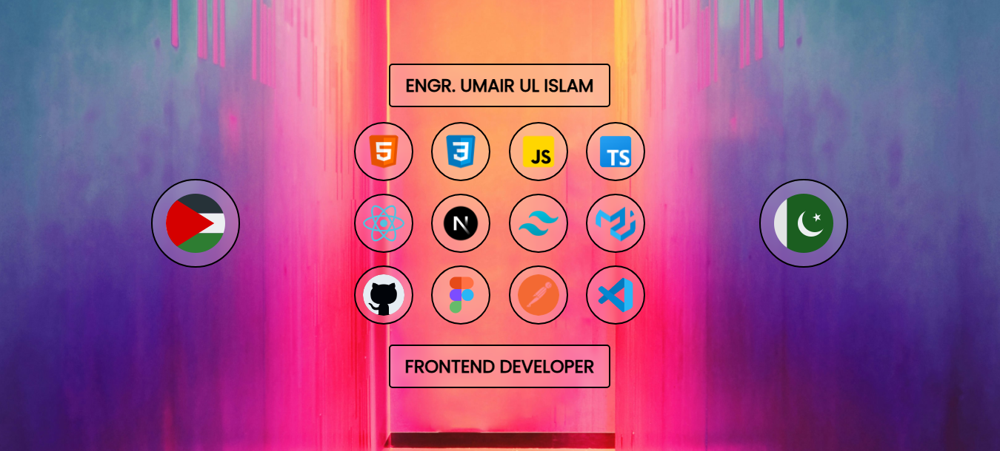

# Hi there, I'm Umair Ul Islam 👋

  

## 🙋‍♂️ About Me

I'm a **Computer Systems Engineering graduate** with a passion for building **modern, responsive web applications**.  
I’ve completed the **Meta Front-End Developer Professional Certificate** on Coursera along with several other courses (see my [portfolio](https://engrumairulislam.netlify.app/#certifications)), constantly improving my skills to stay ahead in the fast-evolving tech world.

💻 I specialise in:

- **Front-End Development** with React & Next.js
- **Modern UI Design** using Tailwind CSS & Material UI
- **TypeScript** for type safety & robust code
- **Testing** with unit and integration tests to ensure smooth performance

✨ My goal is to create **clean, scalable, and fully responsive** apps that look and work great on any device.

📩 **Let’s connect** — if you’ve got an idea or want to collaborate, reach out via the [Contact](https://engrumairulislam.netlify.app/#contact) section of my portfolio.

## 🛠️ Tech Stack

### Frontend

### Backend

### Tools

## 📊 GitHub Stats

## 🌐 Connect with Me

[-000000?style=for-the-badge&logo=x&logoColor=white>)](https://x.com/umairulislam_24)
