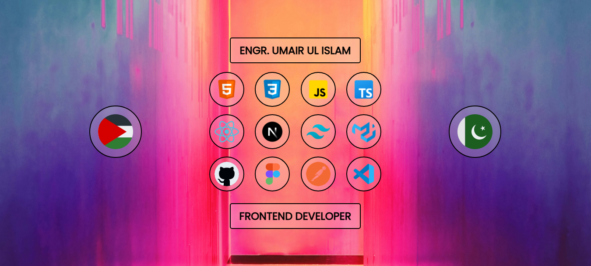

# Hi there, I'm Umair Ul Islam 👋

  

  
  
  
  

---

## 🙋‍♂️ About Me

I'm a **Computer Systems Engineering graduate** and **Frontend Developer** with **1.5+ years of experience** building fast, responsive, and accessible web applications using **React**, **Next.js**, and **TypeScript**.

I hold the **Meta Front-End Developer Professional Certificate** from Coursera, along with several other certifications (see my [portfolio](https://engrumairulislam.netlify.app/#certifications)), and I'm constantly sharpening my skills to keep pace with the fast-evolving web ecosystem.

💻 I specialise in:

- 🏗️ **Frontend Architecture** with React, Next.js & TypeScript
- 🎨 **Modern UI Engineering** using Tailwind CSS, Material UI & Shadcn UI
- 🔄 **State Management** with Redux Toolkit, RTK Query & Zustand
- ♿ **Accessibility & ADA Compliance** to build apps that work for everyone
- 🌐 **CMS Development** with custom WordPress themes

✨ My goal is to build **clean, scalable, and fully responsive** applications that look and perform great on any device.

📩 Have an idea or want to collaborate? Reach out via the [Contact](https://engrumairulislam.netlify.app/#contact) section of my portfolio.

---

## 🛠️ Tech Stack

### Frontend

### State Management & Forms

### Backend

### Tools

---

## 📊 GitHub Stats

  
  

  

---

## 🌐 Connect with Me

  
  
  
  

  <i>⭐️ Thanks for stopping by — check out my pinned repos below to see what I've been building!</i>

